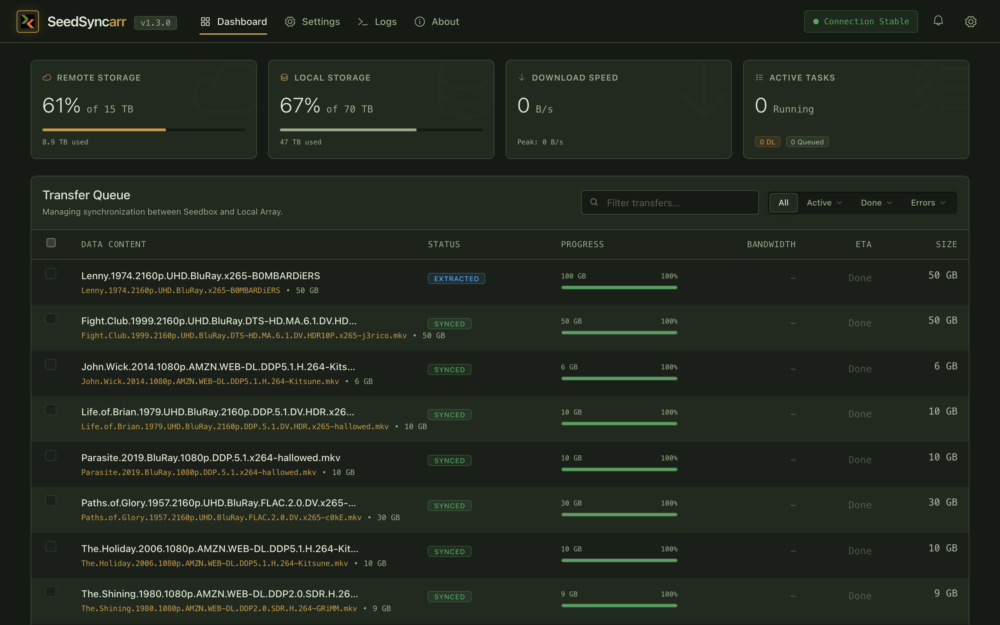

<p align="center">
  
</p>

> Sync files from your seedbox to your local media server — fast, automated, and integrated with Sonarr and Radarr.

[](https://github.com/thejuran/seedsyncarr/actions/workflows/ci.yml)
[](https://github.com/thejuran/seedsyncarr/releases)
[](https://github.com/thejuran/seedsyncarr/pkgs/container/seedsyncarr)
[](LICENSE.txt)

## Quick Start

```yaml
services:
  seedsyncarr:
    image: ghcr.io/thejuran/seedsyncarr:latest
    container_name: seedsyncarr
    restart: unless-stopped
    ports:
      - "8800:8800"
    volumes:
      - ~/.seedsyncarr:/root/.seedsyncarr
      - /path/to/downloads:/downloads
```

## Features

- **LFTP-based transfers** — built on [LFTP](http://lftp.tech/) for maximum transfer speed with parallel connections and segmented downloads
- **Web UI** — monitor and control all transfers from a clean, responsive dashboard
- **Auto-extraction** — automatically extract archives after sync completes
- **AutoQueue** — pattern-based file selection syncs only the files you want
- **Sonarr and Radarr integration** — webhook-driven import notifications for seamless media library updates
- **Local and remote file management** — browse, delete, and manage files on both ends from the UI
- **Docker packaging** — available as Docker images for amd64 and arm64
- **Dark mode** — full dark theme with earthy palette designed for always-on displays

## How It Works

SeedSyncarr runs on your local server and connects to your remote seedbox over SSH. The LFTP sync engine continuously transfers new files to your local machine. When a transfer completes, SeedSyncarr can automatically extract archives and notify Sonarr or Radarr via webhooks to trigger media library imports.

You don't need to install anything on the remote server — just SSH credentials.

## Installation

### Docker (recommended)

Pull and run with Docker Compose (see Quick Start above), or run directly:

```bash
docker run -d \
  --name seedsyncarr \
  --restart unless-stopped \
  -p 8800:8800 \
  -v ~/.seedsyncarr:/root/.seedsyncarr \
  -v /path/to/downloads:/downloads \
  ghcr.io/thejuran/seedsyncarr:latest
```

For detailed setup instructions, see the [documentation](https://thejuran.github.io/seedsyncarr).

## Configuration

After starting SeedSyncarr, open `http://localhost:8800` in your browser.

Key configuration areas in **Settings**:

- **Remote Server** — SSH host, port, username, and path to sync from
- **Local Path** — where files are downloaded to on your local machine
- **Sonarr / Radarr** — webhook URLs and API keys for automated media imports
- **AutoQueue** — define patterns to automatically queue matching files for sync

## Screenshots

<p align="center">
  
</p>

## Related Projects

- [**Triggarr**](https://github.com/thejuran/triggarr) — lightweight search automation daemon for Radarr, Sonarr, and Lidarr. SeedSyncarr handles the download-to-sync side; Triggarr handles the search-to-trigger side.

## Contributing

See [CONTRIBUTING.md](CONTRIBUTING.md) for guidelines.

## Security

See [SECURITY.md](SECURITY.md) for reporting vulnerabilities.

## License

Apache License 2.0 — see [LICENSE.txt](LICENSE.txt).
