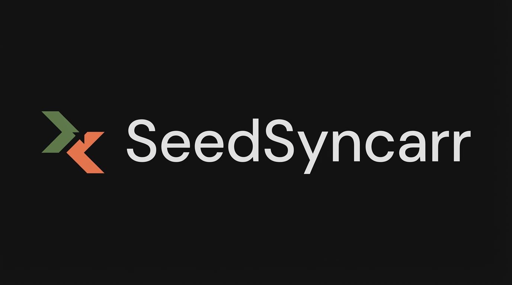

<p align="center">
  <picture>
    <source media="(prefers-color-scheme: dark)" srcset="doc/brand/wordmark-dark.png">
    <source media="(prefers-color-scheme: light)" srcset="doc/brand/wordmark-light.png">
    
  </picture>
</p>

<p align="center">
  
</p>

> A Sonarr-driven seedbox sync tool where an HMAC-verified import webhook drives safe auto-delete — so you never delete a file that didn't make it into your library.

[](https://github.com/thejuran/seedsyncarr/actions/workflows/ci.yml)
[](https://github.com/thejuran/seedsyncarr/releases)
[](https://github.com/thejuran/seedsyncarr/pkgs/container/seedsyncarr)
[](LICENSE)

## About This Fork

SeedSyncarr is a fork of [SeedSync](https://github.com/ipsingh06/seedsync) (ipsingh06). Like other active forks, it modernizes the original; SeedSyncarr's focus is a Sonarr-driven workflow where an HMAC-verified import webhook drives safe auto-delete — so you never delete a file that didn't reach your library. SeedSyncarr is Sonarr/Radarr-driven, so it receives import webhooks from those services rather than pushing notifications outbound.

## Quick Start

```yaml
services:
  seedsyncarr:
    image: ghcr.io/thejuran/seedsyncarr:latest
    container_name: seedsyncarr
    restart: unless-stopped
    environment:
      - PUID=1000   # uid that owns your /config and /downloads host paths
      - PGID=1000   # gid that owns your /config and /downloads host paths
    ports:
      - "8800:8800"
    volumes:
      - ~/.seedsyncarr:/config
      - /path/to/downloads:/downloads
```

> **Set `PUID`/`PGID` to the owner of your mounted paths.** SeedSyncarr writes
> downloads to `/downloads`, so the container user must own (or be able to write)
> the host directory behind it. Find the right values on the host with `id`
> (e.g. `id $USER`). If `PUID`/`PGID` are omitted, the container defaults to
> `1000:1000`. A mismatch here is the most common cause of "files show as active
> but never download" — the container can't write the destination.

## Features

- **LFTP-based transfers** — built on [LFTP](http://lftp.tech/) for maximum transfer speed with parallel connections and segmented downloads
- **Web UI** — monitor and control all transfers from a clean, responsive dashboard
- **Auto-extraction** — automatically extract archives after sync completes
- **AutoQueue** — pattern-based file selection syncs only the files you want
- **Sonarr and Radarr integration** — HMAC-verified import webhooks drive safe auto-delete; once your media library confirms the import, SeedSyncarr removes the local copy
- **Local and remote file management** — browse, delete, and manage files on both ends from the UI
- **Docker packaging** — available as Docker images for amd64 and arm64
- **Dark mode** — full dark theme with earthy palette designed for always-on displays
- **Security by default** — Fernet-encrypted secrets at rest, HMAC-verified import webhooks, opt-in Bearer auth, an IP-resolution guard on Sonarr/Radarr connection URLs, CSP headers, and rate-limited webhook/config/test-connection/bulk/status endpoints. See [SECURITY.md](SECURITY.md) for the full posture.

## How It Works

SeedSyncarr runs on your local server and connects to your remote seedbox over SSH. The LFTP sync engine continuously transfers new files to your local machine, and can automatically extract archives once a transfer completes. Sonarr and Radarr then import the synced files and call SeedSyncarr's inbound webhook endpoint on import — SeedSyncarr uses that confirmation to safely reclaim the local copy, so it never deletes a file that didn't make it into your library.

You don't need to install anything on the remote server — just SSH credentials.

## Installation

### Docker (recommended)

Pull and run with Docker Compose (see Quick Start above), or run directly:

```bash
docker run -d \
  --name seedsyncarr \
  --restart unless-stopped \
  -p 8800:8800 \
  -e PUID=1000 \
  -e PGID=1000 \
  -v ~/.seedsyncarr:/config \
  -v /path/to/downloads:/downloads \
  ghcr.io/thejuran/seedsyncarr:latest
```

Set `PUID`/`PGID` to the uid/gid that owns the host paths mounted at `/config`
and `/downloads` (run `id` on the host to find them; defaults to `1000:1000`).
The container remaps its user to these at start and fixes ownership of the
mount roots, so it can write your downloads.

### pip

Install system dependencies first, then install via pip:

```bash
# Runtime tools (Debian/Ubuntu)
sudo apt install lftp openssh-client p7zip-full unrar bzip2

# Build dependencies for the cryptography wheel (needed on systems
# without a prebuilt wheel for your Python version)
sudo apt install build-essential libssl-dev libffi-dev

# Install SeedSyncarr
pip install seedsyncarr

# Run
seedsyncarr
```

Requires Python 3.11 or 3.12.

For detailed setup instructions, see the [documentation](https://thejuran.github.io/seedsyncarr).

## Configuration

After starting SeedSyncarr, open `http://localhost:8800` in your browser.

Key configuration areas in **Settings**:

- **Remote Server** — SSH host, port, username, and path to sync from
- **Local Path** — where files are downloaded to on your local machine
- **Sonarr / Radarr** — webhook URLs and API keys for automated media imports
- **AutoQueue** — define patterns to automatically queue matching files for sync

## Screenshots

The dashboard — live transfers, sync progress, storage stats, and controls:

<p align="center">
  
</p>

## Related Projects

- [**Triggarr**](https://github.com/thejuran/triggarr) — lightweight search automation daemon for Radarr, Sonarr, and Lidarr. SeedSyncarr handles the download-to-sync side; Triggarr handles the search-to-trigger side.

## Contributing

See [CONTRIBUTING.md](CONTRIBUTING.md) for guidelines.

## Security

See [SECURITY.md](SECURITY.md) for reporting vulnerabilities and the full security posture.

## License

Apache License 2.0 — see [LICENSE](LICENSE).

## Usage Examples

**Sync only TV shows and movies using AutoQueue patterns**

In Settings, enable AutoQueue and turn on "Restrict to patterns". Add glob patterns to match
only the directories you want synced automatically:

```
TV Shows/*
Movies/*
```

Any new file on the remote server whose path matches a pattern is queued for sync without
manual intervention. Files that do not match are left on the remote server untouched.

**Confirm a Sonarr import before cleaning up**

In Settings, enable Sonarr and enter your Sonarr URL and API key. SeedSyncarr exposes an
inbound webhook endpoint at:

```
http://<seedsyncarr-address>:8800/server/webhook/sonarr
```

Add this URL as a webhook in Sonarr (Settings > Connect > Webhook) with the "On Import"
event selected. Sonarr then calls this endpoint after it imports an episode into your
library, and SeedSyncarr treats that incoming call as confirmation the file made it in —
the signal it uses to safely reclaim the local copy. The webhook is HMAC-verified when a
secret is configured. The same pattern applies to Radarr using the
`/server/webhook/radarr` endpoint.

**Automatically clean up after import**

Enable Post-Import Pruning in Settings. Once Sonarr or Radarr confirms an import, SeedSyncarr
waits for the configured safety delay (default: 60 seconds) and then deletes the local copy
from the downloads directory. Enable dry-run mode first to verify which files would be removed
before committing to automatic deletion.
