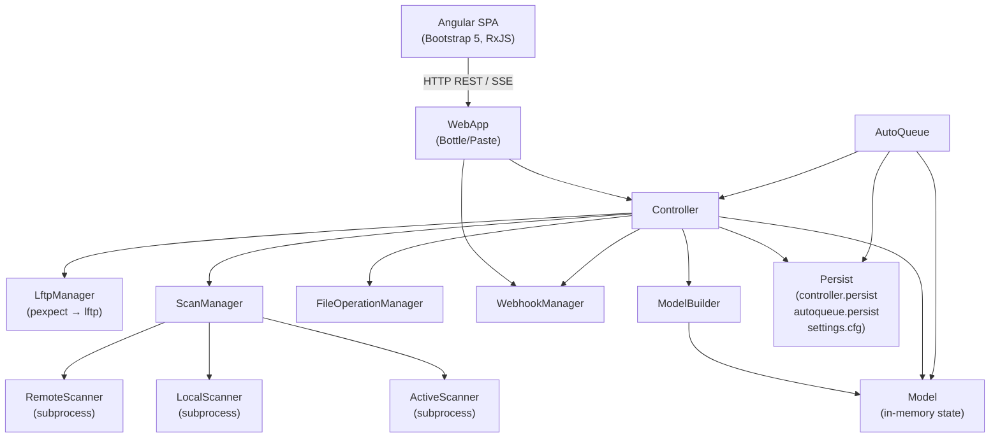

<!-- generated-by: gsd-doc-writer -->
# Architecture

## System Overview

SeedSyncarr is a daemon service that automates syncing files from a remote SFTP/SSH server to a local path using LFTP, with an Angular web UI for monitoring and control. The system has two primary inputs: periodic scans of the remote and local file systems, and user commands issued through the web interface or webhook callbacks from Sonarr/Radarr. Its primary output is downloaded (and optionally extracted) files on the local path. The architecture is a layered, multi-threaded Python backend serving a single-page Angular frontend via an embedded Bottle/Paste web server, with file system scanning offloaded to separate processes via Python multiprocessing.

---

## Component Diagram



---

## Data Flow

A typical file download proceeds through these steps:

1. **Remote scan** — `RemoteScanner` runs as a subprocess at a configurable interval (default 30 s). It copies a scan script (`scan_fs.py`) to the remote host over SFTP and executes it, returning a list of files and their sizes. Results are put onto a multiprocessing queue.

2. **Local scan** — `LocalScanner` runs as a subprocess at a configurable interval (default 10 s) and scans the configured local path for files already present.

3. **Model update** — The `Controller` collects scan results from `ScanManager`, LFTP job statuses from `LftpManager`, and extract results from `FileOperationManager`. These are fed into `ModelBuilder`, which produces a new `Model` snapshot. The diff between old and new models is applied; `IModelListener` callbacks notify registered listeners (including `AutoQueue` and the SSE stream handlers).

4. **Auto-queue** — `AutoQueue` listens to model events. When a remote file appears that matches configured patterns (or all files if pattern-only mode is off), and the file has not been previously downloaded or explicitly stopped, `AutoQueue` posts a `QUEUE` command to the controller's command queue.

5. **Download** — `Controller` processes the command queue each cycle. A `QUEUE` command calls `LftpManager.queue()`, which issues an `mirror` or `pget` command to the long-running `lftp` subprocess managed via `pexpect`. LFTP handles parallel connections, temp-file transfers, and resuming.

6. **Active scan** — While a file is downloading, `ActiveScanner` monitors the local path for the file being actively written, providing real-time size updates to the model.

7. **Completion and extract** — When a file transitions to `DOWNLOADED` state, `AutoQueue` optionally issues an `EXTRACT` command. `FileOperationManager` dispatches an `ExtractProcess` (subprocess using `patool`) to unpack archives.

8. **Webhook import** — When Sonarr or Radarr sends an HTTP POST webhook, `WebhookHandler` enqueues an import event onto `WebhookManager`. On the next controller cycle, the import event is matched against the model (case-insensitively, including child files inside directories), the file's `import_status` is set to `IMPORTED`, and if auto-delete is enabled a `threading.Timer` is scheduled to delete the local file after the configured delay.

9. **SSE push to UI** — `ModelStreamHandler`, `StatusStreamHandler`, and `LogStreamHandler` are registered SSE stream handlers. The `/server/stream` endpoint yields Server-Sent Events to the Angular frontend. The frontend uses RxJS observables to keep the file list, status bar, and log terminal up to date in real time.

---

## Key Abstractions

| Abstraction | File | Description |
|---|---|---|
| `Seedsyncarr` | `src/python/seedsyncarr.py` | Top-level entry point; owns config loading, thread lifecycle, and persist scheduling. |
| `Controller` | `src/python/controller/controller.py` | Orchestrates all backend subsystems; drives the main processing loop. |
| `Model` / `IModelListener` | `src/python/model/model.py` | Thread-safe in-memory file state store with observer notification. |
| `ModelFile` | `src/python/model/file.py` | Immutable (frozen after add) value object representing one remote/local file and its state. |
| `ModelBuilder` | `src/python/controller/model_builder.py` | Merges scan, LFTP, and extract data into a consistent `Model` snapshot. |
| `AutoQueue` | `src/python/controller/auto_queue.py` | Listens for model changes and sends queue/extract commands based on patterns. |
| `WebApp` | `src/python/web/web_app.py` | Bottle-based HTTP server; handles auth middleware, CSP headers, SSE streaming, and static file serving. |
| `WebhookManager` | `src/python/controller/webhook_manager.py` | Thread-safe queue bridging the web thread (receive) and controller thread (process) for Sonarr/Radarr imports. |
| `Persist` / `ControllerPersist` | `src/python/common/persist.py`, `src/python/controller/controller_persist.py` | JSON-serialised state files for downloaded/extracted/stopped/imported file tracking, using `BoundedOrderedSet` (LRU, 10 000 entry cap) for each set. |
| `Config` | `src/python/common/config.py` | INI-based (`configparser`) application configuration with typed section classes and validation. |
| `Status` / `StatusComponent` | `src/python/common/status.py` | Observable server/controller status values pushed to the UI via SSE. |
| `ScannerProcess` | `src/python/controller/scan/scanner_process.py` | Generic wrapper that runs a scanner at an interval in a separate `multiprocessing.Process`. |
| `Lftp` | `src/python/lftp/lftp.py` | Wraps the system `lftp` binary via `pexpect`; handles queue, kill, and status commands. |

---

## Directory Structure Rationale

```
src/
├── angular/          # Angular 21 single-page frontend (TypeScript/Bootstrap 5)
│   └── src/app/
│       ├── pages/    # Route-level components: main (file list), settings, logs, autoqueue, about
│       └── services/ # Angular services: model-file, server-command, config, log, stream base
├── python/           # Python 3.11 daemon backend
│   ├── common/       # Shared utilities: Config, Context, Persist, Status, constants, job base classes
│   ├── controller/   # Core orchestration: Controller, AutoQueue, ScanManager, LftpManager, FileOperationManager, WebhookManager
│   │   ├── scan/     # Scanner subprocess implementations: RemoteScanner, LocalScanner, ActiveScanner
│   │   ├── extract/  # Archive extraction subprocess (patool-based)
│   │   └── delete/   # Local and remote file deletion subprocess wrappers
│   ├── lftp/         # pexpect-based LFTP process wrapper and job status parser
│   ├── model/        # ModelFile, Model, ModelDiff, ModelBuilder data layer
│   └── web/          # Bottle WebApp, route handlers, SSE stream handlers
├── docker/           # Multi-stage Dockerfile (Node 22 Angular build + Python 3.11 runtime) and helpers
└── e2e/              # Playwright end-to-end test suite (runs against a live Docker container)
```

The backend runs in a single Python process with two long-lived threads (`ControllerJob` and `WebAppJob`) plus a pool of short-lived subprocesses (scanners, extract, delete). All scanner subprocesses communicate results back to the controller thread via `multiprocessing.Queue`. The web server thread (Paste, multi-threaded WSGI) communicates with the controller thread exclusively through `Controller.queue_command()` (a `queue.Queue`) and read-only access to `get_model_files()` under a `threading.Lock`.
