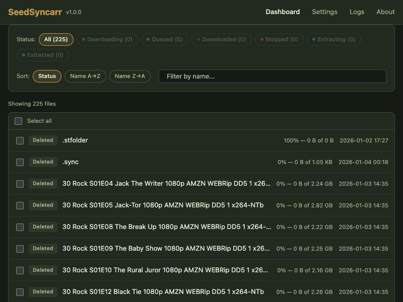

# SeedSyncarr

Fast, reliable file syncing from your seedbox to your local media server — powered by LFTP, with native Sonarr and Radarr integration.



## Features

- **LFTP-powered sync** — parallel, resumable downloads over SSH/SFTP
- **Web dashboard** — real-time file status, progress, and controls
- **Sonarr & Radarr webhooks** — automatic import detection via native *arr integration
- **AutoQueue** — automatically queue new remote files for download
- **Auto-extraction** — unpack archives after download completes
- **Auto-delete** — clean up seedbox files after successful import
- **Dark mode** — light and dark themes with automatic OS detection

## Quick Start

```yaml
services:
  seedsyncarr:
    image: ghcr.io/thejuran/seedsyncarr:latest
    container_name: seedsyncarr
    ports:
      - "8800:8800"
    volumes:
      - ./config:/root/.seedsyncarr
      - /path/to/downloads:/downloads
    restart: unless-stopped
```

```bash
docker compose up -d
```

Open [http://localhost:8800](http://localhost:8800) to access the dashboard. See the [Installation Guide](install.md) for more options including pip install.

## Next Steps

- [Installation Guide](install.md) — Docker Compose and pip install options
- [Configuration Reference](configuration.md) — all settings explained
- [Sonarr & Radarr Setup](arr-setup.md) — connect your *arr apps
- [FAQ & Troubleshooting](faq.md) — common issues and solutions
